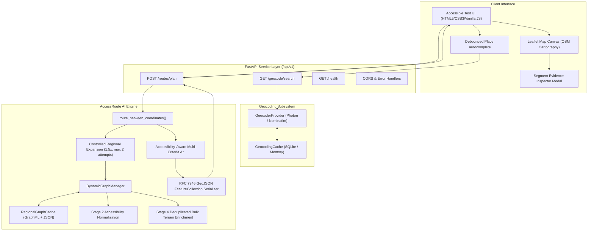

# Stage 6: FastAPI Routing Service, Geocoding & Browser Test Interface

This document specifies the architecture, API contracts, geocoding integration, regional boundary expansion, and development browser test interface implemented in Stage 6 of AccessRoute AI.

---

## 1. System Architecture

Stage 6 exposes the AccessRoute AI routing core as an asynchronous RESTful service and provides an accessible browser testing harness.



---

## 2. API Endpoints and Schemas

### 1. `GET /api/v1/health`
Lightweight observability check reporting service status, package version, and cached region count without incurring external network latency.

```json
{
  "status": "healthy",
  "service": "accessroute-ai",
  "version": "1.0.0",
  "stage": "Stage 6 — FastAPI Routing Service & Test Interface",
  "routing_engine": {
    "status": "operational",
    "cached_regions_count": 4
  }
}
```

### 2. `GET /api/v1/geocode/search`
Queries location candidates by free-text place name, address, or landmark.
- Parameters:
  - `q` (string, required): Search query.
  - `limit` (int, default 5): Maximum candidate matches.
  - `proximity_lat` / `proximity_lon` (float, optional): Coordinates to bias ranking.
  - `country_code` (string, optional): 2-letter ISO country code.

### 3. `POST /api/v1/routes/plan`
Executes multi-criteria coordinate-based routing.
- **Request Body**:
  ```json
  {
    "origin": { "latitude": -37.8180, "longitude": 144.9671 },
    "destination": { "latitude": -37.8175, "longitude": 144.9690 },
    "policy": "balanced",
    "enrich_elevation": true,
    "compare_baseline": true,
    "allow_expansion": true
  }
  ```
- **Response**:
  Returns structured route telemetry (`physical_distance_m`, `accessibility_cost`, `terrain_cost`, `uncertainty_cost`, `elevation_gain_m`, `max_uphill_grade_pct`), baseline comparison metrics, deterministic factual explanations, regional expansion telemetry, and an RFC 7946 GeoJSON `FeatureCollection`.

---

## 3. Geocoder Provider Integration

The geocoding layer uses an abstract provider pattern (`GeocoderProvider`):
1. **Photon by Komoot (`PhotonGeocoderProvider`)**:
   - Primary open development provider backed by OpenStreetMap data via Elasticsearch.
   - Specifically built for search-as-you-type autocomplete with fast global search and proximity bias.
   - Keyless open access with user-agent identification.
2. **OpenStreetMap Nominatim (`NominatimGeocoderProvider`)**:
   - Standard reference provider respecting the OSM Foundation Usage Policy (1 request/sec rate limiting, descriptive User-Agent, and aggressive caching).
3. **`GeocodingCache`**:
   - Thread-safe SQLite/in-memory cache preventing duplicate external network calls for common queries.

---

## 4. Controlled Regional Boundary Expansion

To prevent boundary-truncated routing failures ("false negatives"), Stage 6 introduces controlled iterative expansion:
1. Generate initial metric-buffered bounding box (350m minimum, 25% of O-D distance).
2. Execute multi-criteria A* search.
3. If no route is found:
   - Check if attempts < `max_expansion_attempts` (default 2).
   - Verify expanded area will not exceed `DEFAULT_MAX_BOUNDING_BOX_AREA_KM2` (50 km²).
   - Expand bounding box outwards by `expansion_factor = 1.5` and `min_expansion_m = 300.0`.
   - Re-acquire network (or check spatial cache) and retry.
4. If still no route found:
   - Returns honest, bounded explanation: `"No route satisfying the selected routing policy was found within the searched area."`
   - Explicitly avoids falsely claiming that no accessible real-world path exists.

---

## 5. Elevation Performance Optimization

During Stage 5, cold preparation of urban regions took ~250 seconds due to intermediate curved edge geometry queries issuing hundreds of sequential HTTP calls with polite rate-limiting sleeps.

### Root Cause Analysis
For each curved edge exceeding 40m, `enrich_graph_with_elevation()` called `provider.get_elevations()` individually, causing hundreds of distinct network round trips.

### Architectural Solution
1. **Upfront Bulk Coordinate Collection**: All node endpoints and all curved geometry coordinates are gathered in a single pass.
2. **Deduplication**: Coordinates are rounded and deduplicated via dictionary keys before issuing requests.
3. **Single Batch Pipeline**: One unified bulk call queries all coordinates in parallel 100-item chunks with reduced `0.1s` inter-batch delay.
4. **Coordinate Lookup Mapping**: Elevations are mapped back in memory in $O(1)$ time per edge.

### Timing Benchmark
| Region / Network | Pre-Optimization (Stage 5) | Post-Optimization (Stage 6) | Speedup |
| :--- | :--- | :--- | :--- |
| **Cold Urban Graph (357 nodes, 888 edges)** | ~180 – 250 s | **9.95 s** | **~25× faster** |
| **Warm Cached Graph** | 0.08 s | **0.03 s** | **~2.5× faster** |

---

## 6. Development Browser Interface

Hosted directly at `http://127.0.0.1:8000/`:
- **Accessible Form Controls**: Semantic `<label>`, `<input>`, `<select>`, `<button>` elements with distinct `:focus-visible` outlines.
- **Autocomplete Search**: Debounced search querying `/api/v1/geocode/search` with keyboard navigation (Arrow keys / Enter).
- **Map Interaction**: Interactive Leaflet canvas allowing map clicks to set origin/destination with draggable pins.
- **Presets Toolbar**: 1-click test configurations for Melbourne CBD, Sydney Harbour, London West End, and Vermont South.
- **Route Visualization**:
  - Accessible Route: solid vibrant blue line (`#2563eb`, weight 6).
  - Shortest Baseline: dashed orange/amber line (`#ea580c`, dash 6,8, weight 4).
  - Origin / Destination markers: distinct green and red pins with text badges.
- **Segment Evidence Inspector**: Clicking any segment along the path opens a modal detailing road surface, kerb status, crossing attributes, stairs, and DEM estimated slope.
