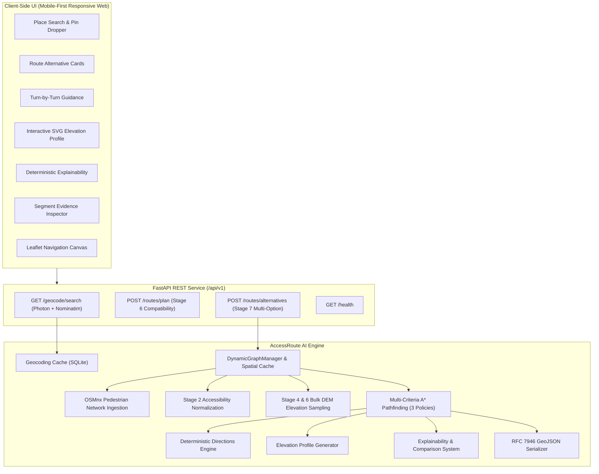

# AccessRoute AI — Stage 7: Public MVP Product UI, Route Alternatives & User Experience

## 1. Executive Summary & Objective

Stage 7 transforms the engineering and diagnostic test harness of Stages 1–6 into a **clean, responsive, accessible Public MVP** navigation application. An ordinary user with no knowledge of $A^*$, OpenStreetMap graph schemas, Digital Elevation Models (DEMs), or GeoJSON can now:
1. Search or drop pins for origin and destination locations.
2. Calculate and compare up to 3 distinct, understandable route alternatives.
3. Select an alternative and inspect step-by-step turn guidance with accessibility cues.
4. Visualize an interactive elevation profile synchronized directly with the map.
5. Understand deterministic, factual explanations of why each route was chosen.
6. Click any route segment to inspect granular infrastructure findings.
7. Use the interface seamlessly across desktop, tablet, and mobile viewports.

---

## 2. Public MVP Architecture

The application cleanly separates user-facing presentation, HTTP coordination, and the underlying multi-criteria geographic routing engine:

---

## 3. Route Alternatives Architecture

Stage 7 exposes up to 3 meaningful pedestrian options derived from the routing intelligence developed in earlier stages:

| Alternative Category | Algorithmic Policy | User-Facing Description | Visual Line Style |
| :--- | :--- | :--- | :--- |
| **Accessibility-Aware** *(Recommended)* | `BALANCED_ACCESSIBILITY_POLICY` | Prioritises available accessibility evidence while avoiding known barriers (stairs, unramped kerbs, unpaved surfaces). | Solid Royal Blue (`#2563eb`), 6px stroke, 0.95 opacity |
| **Lower Estimated Slope** | `CONSERVATIVE_ACCESSIBILITY_POLICY` | Prefers paths with lower estimated terrain difficulty based on DEM slope evidence; applies strict penalty above 4% grade. | Dashed Emerald Green (`#059669`), 5px stroke, dash `8, 6` |
| **Shortest Available** | `DISTANCE_FIRST_POLICY` | Primarily minimises physical distance while still respecting hard accessibility prohibitions (steps without ramps). | Dashed Amber (`#d97706`), 4px stroke, dash `4, 6` |

### Path Deduplication Logic
When two policies produce the exact same sequence of nodes (e.g. in a flat grid where the shortest path is already paved and step-free), AccessRoute AI automatically consolidates them:
- The system labels the card **"Recommended (Shortest)"**: *"The shortest physical path already satisfies all accessibility criteria."*
- Duplicate redundant lines are eliminated from the map and card list, ensuring the user only compares genuinely distinct physical detours.

---

## 4. Deterministic Turn-by-Turn Guidance

Navigation instructions are generated deterministically without relying on third-party routing APIs or external LLMs:

1. **Bearing & Angle Classification**:
   - Calculates forward azimuth $\beta_1$ and $\beta_2$ for consecutive edges:
     $$\Delta\beta = (\beta_2 - \beta_1 + 180) \pmod{360} - 180$$
   - Maps angle transitions to intuitive maneuvers:
     - $|\Delta\beta| \le 20^\circ \implies$ Continue straight
     - $20^\circ < \Delta\beta \le 45^\circ \implies$ Turn slightly right
     - $45^\circ < \Delta\beta \le 135^\circ \implies$ Turn right
     - $135^\circ < \Delta\beta \le 180^\circ \implies$ Turn sharply right
     - Left turn analogs for negative angles
     - Road crossings mapped to "Cross at pedestrian crossing"
2. **Street & Pathway Name Resolution**:
   - Uses OSM `name` tags when available, falling back to contextual descriptors ("Swanston Street", "Library Footpath", "Sidewalk", "Pedestrian crossing").
3. **Accessibility Findings Enrichment**:
   - Attaches factual cues to each step:
     - `✓ Recorded paved surface (asphalt)`
     - `✓ Lowered/flush kerb recorded at crossing`
     - `⚠ Kerb ramp status unrecorded at crossing`
     - `⚠ Recorded unpaved surface (gravel)`
     - `ℹ Estimated moderate uphill grade: 4.5%`

---

## 5. Interactive Elevation Profile & Map Synchronisation

Terrain intelligence is visualized via a custom SVG elevation chart:
- **X-Axis**: Cumulative distance along route ($0$ to total distance).
- **Y-Axis**: Elevation in meters above sea level.
- **Micro-Interactions**:
  - Hovering or dragging along the elevation chart displays vertical crosshairs, exact distance, and estimated elevation.
  - **Dynamic Map Pulse**: Interacting with the chart projects a synchronized pulsing marker (`.elevation-map-marker`) onto the exact geographic coordinates on the Leaflet map.
- **Statistical Breakdown**:
  - Elevation Climb (+X m)
  - Elevation Descent (-X m)
  - Maximum Estimated Uphill Slope (%)

---

## 6. Honest Explainability: Known vs. Estimated vs. Unknown

AccessRoute AI strictly maintains the boundary between proven physical facts and inferred or missing data:

| Evidence Tier | Data Source | Example Statement | Visual Treatment |
| :--- | :--- | :--- | :--- |
| **Known Data** | OSM confirmed tags | *"This route avoids 1 mapped staircase used by the shorter walking route."* | Green check (`✓`), blue left border |
| **Estimated Terrain** | Copernicus GLO-30 DEM | *"Maximum estimated uphill slope is 4.8% (Copernicus DEM). Micro-topography and building ramps may vary."* | Informational (`ℹ`), explicit "Estimated" label |
| **Unknown / Missing Data** | Missing OSM tags | *"Kerb ramp information is unrecorded at 2 crossings. Accessibility metadata is incomplete for 28% of path."* | Amber warning (`⚠`), warning left border |

AccessRoute AI **never** labels a route "Safest", "Guaranteed Accessible", or "Wheelchair Safe".

---

## 7. Responsive Mobile & Desktop Design

- **Desktop Viewport**: Split layout with a fixed 440px navigation drawer on the left and a full-height interactive map on the right.
- **Mobile Viewport**:
  - Full-screen map with bottom sheet drawer.
  - 3 Snap States:
    1. **Peek State** (height ~130px): Allows searching or viewing origin/destination while keeping 85% of map visible.
    2. **Half Sheet** (height ~50%): Automatically expands upon route calculation to present route cards and summary metrics.
    3. **Expanded Sheet** (height ~85%): Allows full scrolling of turn-by-turn guidance, elevation profiles, and explainability cards.
  - Draggable handle and click toggle.

---

## 8. Accessibility & WCAG 2.2 AA Compliance

1. **Contrast & Color-Independence**:
   - Text contrast ratios exceed 5:1 (main text `#0f172a` on `#ffffff` is 16:1).
   - Routes are distinguished by line width, dash patterns (`dashArray: "8, 6"` vs solid), text titles, and badges — never color alone.
2. **Touch Targets**:
   - All interactive controls (buttons, inputs, tabs, preset pills) have minimum touch dimensions $\ge 44 \times 44$ px.
3. **Keyboard Navigation & Visible Focus**:
   - All controls have `:focus-visible` rings (`2.5px solid #2563eb`, 2px offset).
   - Autocomplete and route cards support Arrow keys, Enter, Space, and Escape.
4. **Assistive Technology**:
   - Semantic HTML5 (`<header>`, `<nav>`, `<aside>`, `<main>`, `<ol>`, `<form>`).
   - Dynamic route updates announced via `role="status"` live region.
   - Screen-reader friendly route summaries.
5. **Reduced Motion**:
   - Respects `prefers-reduced-motion` to disable animations.

---

## 9. Test Verification Results

All 140 automated tests pass in ~1.3 seconds:
- 109 tests from Stages 1–5 (OSM graph, caching, snapping, A*, elevation enricher, heuristics).
- 18 tests from Stage 6 (FastAPI routing, geocoding cache, regional expansion, GeoJSON).
- 13 new tests for Stage 7:
  - `test_directions.py`: Bearing calculation, relative turn angle, maneuver classification, street name extraction, accessibility cues.
  - `test_elevation_profile.py`: Sampled distance-elevation points, gain/loss, max slope %, empty route handling.
  - `test_route_alternatives.py`: Multi-policy evaluation, path deduplication, plain-language cards, 0m distance handling.
  - `test_api_stage7.py`: `POST /api/v1/routes/alternatives`, GeoJSON feature collection, coordinate validation.

Total: **140 passed in 1.32s**.
